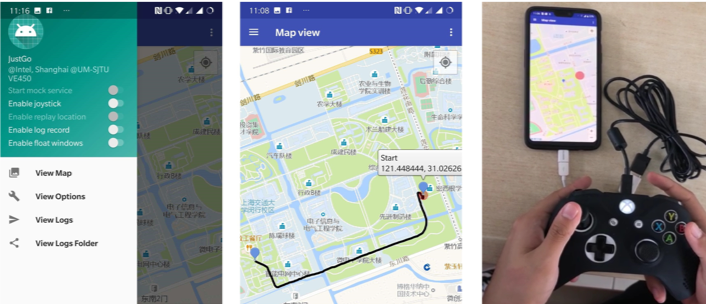
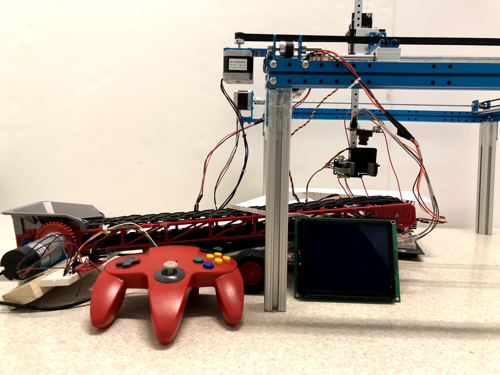

=========================
Major Design Projects
=========================

Opera - A Rhythm Shooter Game
---------------------------------

Ultimate Opera Fight is a 3D third person shooter game where players compete in teams, 
collect bullets with different specialties and fire towards each other for the opportunity to perform on stage.
You can go solo, or fight for the team, be a sharp eye shooter, 
or a decent bullet dodger; what only matters is to make it to the Star (on the score bar).

.. raw:: html

    <iframe style="border-radius: 10px" width="500" height="300" src="https://www.youtube.com/embed/OdHYIFbXyHY" frameborder="0" allow="accelerometer; autoplay; encrypted-media; gyroscope; picture-in-picture" allowfullscreen></iframe>

The game is made by Studio Next-Door: Edmond Tsoi, Fang Han, Justin Pan and Qianlie Wang. 
Please visit the official website for more details.

JustGo - Integrated Virtual Vehicle Simulation Platform on Android 
------------------------------------------------------------------------

Company Sponsor: Android SH PNP, Intel 

Company Mentor: Wu Zhongmin, Intel 

Advisor: Pradeep Ray

Our team (Fang Han, Heming Han, Shengting Shao, Zhu Wang, Cheng Xu), sponsored by Android SH PNP at Intel, aims to deliver a more intelligent and robust Android simulation platform, which provides great utilities such as dashboard display panels, mock location providers and other operational interfaces. Embedded system designers who build in-vehicle infotainment will benefit from this platform and improve their productivity.

Project Focuses:

- Simulate driving condition in laboratory
- Help develop virtual vehicle dashboard for IVI engineers
- Significant role in a macro IVI Ecosystem

.. raw:: html

    <iframe style="border-radius: 10px" width="500" height="300" src="https://www.youtube.com/embed/yJTNRokCfCk" frameborder="0" allow="accelerometer; autoplay; encrypted-media; gyroscope; picture-in-picture" allowfullscreen></iframe>

Package Sorting Robot
-----------------------------

.. raw:: html

    

.. role:: red

A embedded system design project presented by Dali Zhang, Fang Han, Jiale Huang and Zizhao Wang. :red:`Best Project Award!`

   
The package sorting robot can significantly improve the efficiency and accuracy of classify the packages compared with traditional human sorting process. It also has full-automatic processing pipeline including delivering(conveyor belt), sorting(camera color detection and object classification), packing(bridge crane and controller) and monitoring (display).

